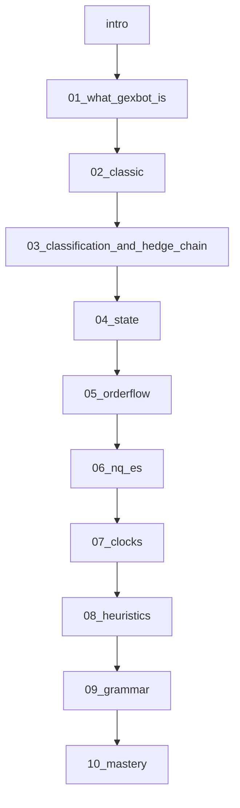

# Gexbot textbook wiki

Build a **deployable Docusaurus wiki** whose **backbone is Gexbot** — its plans and capabilities — used as an information layer beside NQ/ES. Schoolbook options ideas are not a pre-course. They appear **just-in-time**, in the chapter whose screen first needs them. One **microstructure spine** runs through every chapter: for each Gexbot object, name who must act, what pressures them, when, and where the screen shows it. Author as MDX. Keep [20260910_gexbot_study.md](20260910_gexbot_study.md) unchanged as the concept SoT.

Not a signal machine. Not a locked edge. Not an options textbook that later mentions Gexbot. Not a color-rule cheat sheet.

## Backbone: plans, then capabilities

Organize the book the way the product is sold and sat:

- **Classic** — unsigned GEX from open interest and from volume. First screen. Nearest cousin of public GEX maps.
- **State** — classified residual ladders (OP, GEX profile, DEX, convexity). Requires the classification engine.
- **Orderflow** — classified time series (`dexoflow`, `gexoflow`, `cvroflow`) plus nets. Increment and integral of the same leftover.
- **Quant** — API / WebSocket; clock 09:30–16:00 ET; explicit-expiry groups live-only. On the map; not a trading chapter.
- **Research (gbR)** — sibling product, any-ticker surfaces, not the classified engine. On the map; not this course.

The **classification engine** is the capability that turns Classic into State and Orderflow. Teach it as the bridge between those plans. The bridge chapter is also where the **hedge chain** is taught once, so every later screen can point back to a link in it.

NQ/ES conversion, clock families, and residual-only −vanna/charm are **capabilities that sit on the plans**. They get their own chapters after the reader can name Classic / State / Orderflow objects.

## Microstructure spine: who must act, and where it shows

Every Gexbot object answers the same question: **who has to do something, why, when, and which screen shows it.** Newcomers get mechanics instead of color rules. Professionals get the caveats stated instead of implied.

### Four kinds of pressure

Use these words exactly. They are the book’s most important vocabulary after the Gexbot terms.

- **Mandate** — a dealer / market-maker book runs delta-neutral by policy and risk limit (**market-general**). When a customer print lands, the dealer’s delta changes and is hedged in the underlying (ES, NQ, SPY, index futures), mostly at once. When spot moves, gamma changes that delta again → re-hedge. When time passes or vol moves, charm / vanna change it → re-hedge with spot unchanged. **This is the only flow the book may call “forced.”**
- **Incentive** — the customer who owns or wrote the residual is not obliged to do anything, but theta, vol crush, margin and P&L push them. Gexbot’s OP wall / fuel folklore lives here (customer longs dump, customer shorts defend). Write **incentivized**, never forced.
- **None** — cancelled two-way volume. Matched buys and sells leave nobody holding risk. No residual → no Gexbot node → no pressure. Quiet ladder ≠ nothing traded.
- **Unknown** — Classic OI and volume bars. The location of gamma is real; the owner’s sign is not visible. “Dealers are short the OI” is an **assumption**. Write it as one.

### The hedge chain (taught in Ch. 3, referenced everywhere)

1. **Print** — a customer crosses the spread. Gexbot signs it long / short. An Orderflow bar is this moment.
2. **Absorb** — the counterparty (often a dealer, sometimes another customer) now holds the mirror position. Two customers → cancellation → link 3 onward does not happen.
3. **Initial delta hedge** — dealer trades share-equivalents in the underlying, usually within seconds. By the time a DEX bar is on screen, this leg is largely done. **DEX records a lean; it is not a queue of pending buying.**
4. **Gamma re-hedge** — as spot moves, delta drifts. Dealer short gamma buys rips / sells dips (amplifies, takes liquidity). Dealer long gamma sells rips / buys dips (dampens, supplies liquidity). This is the **pending** forced flow and it is **path-conditional**. Convexity ladder and GEX profile show where and with which sign; they cannot show the path.
5. **Clock re-hedge** — charm and vanna move delta with spot unchanged. Dealers re-hedge passively through the day, hard in the last hour. −vanna / charm ladders (beta) are Gexbot’s view of this link on **today’s residual only**.
6. **Resolution** — expiry. ITM → |delta| 1, OTM → 0; hedges unwind. SPX daily expiries are PM cash-settled (**market-general**). Gexbot shows none of this link directly.

What no Gexbot screen shows: the hedge itself, how much is already hedged, overnight inventory beyond Classic OI, whether the customer hedged their own delta, open vs close.

### Already hedged vs pending — the newcomer trap

The single most damaging misread is reading a DEX bar as “buying still to come.” Teach the split explicitly, in Ch. 4 and again in Ch. 5:

- **Delta print (DEX)** → hedge is already on. Read it as **where customers lean**.
- **Gamma (convexity, GEX profile, GEX OF)** → hedge is **ahead**, conditional on spot moving.
- **Charm / vanna** → hedge is **ahead**, conditional on the clock and vol, not on spot.

Only the last two are “forced flow ahead.” The first is a record.

### Liquidity roles

- Dealer long gamma hedges **against** the move → passive → resting orders, absorption → pin / calm.
- Dealer short gamma hedges **with** the move → aggressive → market orders, sweeps → trend / amplify.
- Customer long options, falling vol: dump on approach → supply liquidity → stall (**folklore**).
- Customer short options, falling vol: hedge / add on approach → take liquidity → continuation (**folklore**). Rising vol flips both.

The book **infers** these roles from Gexbot. It never observes them. It never claims to identify a hedge print on the futures tape.

### Forced-flow ledger (one row per screen)

Becomes [docs/reference/forced-flow-ledger.mdx](docs/reference/forced-flow-ledger.mdx). Each chapter reproduces its own rows.

| Gexbot screen | Shows | Who acts · pressure | Trigger for the next move | Hedge venue | Not shown |
|---|---|---|---|---|---|
| Classic GEX by OI | Location of overnight inventory gamma, unsigned | Unknown owner. *If* the dealer-short shortcut holds, dealers re-hedge on spot moves (mandate) | Spot moving through the region | ES / SPY / index futures | Owner sign; hedges already on; today’s trades |
| Classic GEX by volume, zero gamma, majors, max-change | Where curvature traded today, unsigned | Unknown | Spot moves | — | Who bought / sold; whether anyone is stuck |
| State OP | Customer long vs short residual per strike, per right | Customer · **incentive** (theta, vol crush, margin). Dealer · **mandate** on the mirror | Approach to the strike; vol regime | Options + underlying | Open vs close; dealer inventory from prior days |
| DEX ladder | Customer residual share-equivalent | Dealer initial delta hedge · mandate · **mostly already done** | — (record) | ES / NQ / SPY | Whether the customer self-hedged; timing of hedge |
| Convexity ladder | Customer long Γ − short Γ | Dealer mirror gamma · mandate · **pending, path-conditional**. Customer · incentive (expansion vs pin) | Spot path | ES / NQ | Hedge bands; fraction already hedged |
| GEX profile | Call vs put imbalance of residual gamma | Which wing forces the re-hedge | Spot direction | — | Bought vs sold (that is convexity) |
| DEX OF / convexity OF / GEX OF | Increment — the moment pressure was created | Dealer absorbs now · mandate | The print itself | ES / NQ / SPY | Open vs close; counterparty identity |
| Net GEX / net convexity / agg DEX | Running integral of the above | Day’s aggregate lean of the pending re-hedge | — | — | Anything before 09:30 |
| −vanna / charm ladders (beta) | Clock-forced re-hedge with spot unchanged, today’s residual | Dealer · mandate | Time; vol collapse | ES | Full OI book; thresholds are discretionary folklore |

## Audience and learning curve

Primary reader: can follow an NQ or ES chart; has **not** traded options; does not yet own delta/gamma.

Every reader starts at **What Gexbot is**. There is no “go read five options chapters first.”

When a screen needs a schoolbook word, stop and teach it **as the reason that Gexbot object exists**:

- Classic plots call GEX vs put GEX → now define call, put, strike, expiry, 0DTE, gamma.
- Classic uses OI and volume → now define those.
- Classification signs a print → now define bid / ask, aggressor, and the **dealer’s delta-neutral mandate** (market-general).
- State plots DEX → now define delta and share-equivalent, then **already hedged vs pending**.
- Convexity is long option minus short option → now define paid vs collected, long vs short gamma, and which one chases.
- Last-hour ladders use −vanna and charm → now define those, not in week one.

**NeededForThisScreen** boxes hold the schoolbook definition. Fluent readers collapse them and keep walking the Gexbot object. Newcomers open them. Same chapter, same backbone.

**Screen orientation first.** Left / right means four different things across Gexbot screens: Classic right = call GEX, left = put GEX; State OP right = customer long, left = customer short; GEX profile right = call imbalance, left = put imbalance; −vanna / charm right = customers gain deltas → dealers buy. Newcomers misread *side* more than anything else. Every screen chapter opens with a **ScreenOrientation** card: axis, side, sign, color (OP puts purple, calls orange), unit, expiry group, clock.

**Newcomer questions**, answered without oversimplifying, close each chapter (three at most). Example: “Is a big green bar bullish?” → “It is call-sided gamma. On SPX it is often sold calls (folklore). Whether it stalls or fuels depends on owner and vol regime, and Classic cannot show the owner.”

Vanna and charm stay parked until the clocks / late-greeks chapter. Dealer-hedge polarity is introduced in Ch. 3 after Classic has taught long vs short gamma.

## Evidence labels and verbs

Gexbot claims keep the SoT labels: **docs / folklore / inferred / not stated**. Add one label for facts that are not Gexbot claims:

- **market-general** — options and futures market facts (contract multipliers, settlement style, delta-neutral market-making, that dealers hedge in bands). Cite one public exchange or textbook source per fact on the reference page. Do not attribute these to Gexbot.

Three verbs, used precisely:

- **observed** — a print or bar on a Gexbot screen.
- **inferred** — a hedge or a liquidity role you did not see.
- **assumed** — ownership on an unsigned screen.

“Must” is reserved for **mandate**. Never write “dealers must buy” from a Classic bar. Write “if the usual ownership shortcut holds, dealers would buy.”

## Textbook rules (every chapter)

- Open with **which Gexbot plan or capability this is**, **what you will be able to read on the screen**, and **what you already need**.
- Screen chapters then show the **ScreenOrientation** card before any concept.
- Preview **terms you will meet** (Gexbot terms first; schoolbook terms marked as NeededForThisScreen).
- Define every new term **at first use** from the shared lexicon.
- After a Gexbot definition: GexbotConcept block, **WhoMustAct** block, one SoT metaphor, tiny number, embed.
- After a schoolbook definition: one metaphor, tiny number, then **immediately return to the Gexbot object** that required it. Do not continue a schoolbook tour.
- Carry the **running example** (below) through the chapter’s screen in one paragraph.
- Close with summary, terms introduced, newcomer questions, check-yourself, gate to the **next plan or capability**.
- Label claims **docs / folklore / inferred / not stated / market-general**. Use observed / inferred / assumed verbs.
- Do not invent Gexbot terms.

### Extra rule for every Gexbot-specific term

**GexbotConcept** block, in this order:

1. Canonical definition.
2. **Unit** — what is counted.
3. **Not counted**.
4. **Nearest cousin**.
5. **Distinguishing cut**.
6. **Import mistake**.
7. Tiny number or 2×2 walk.

Then a **WhoMustAct** block: actor · pressure (mandate / incentive / none / unknown) · trigger (print / spot move / vol move / clock / expiry) · direction of the hedge given a spot move up · venue · liquidity role · visible on this screen as · **not shown**. If the honest answer is “unknown,” the block says unknown. The block is never omitted.

## Professional guardrails (do not oversimplify)

Becomes [docs/reference/guardrails.mdx](docs/reference/guardrails.mdx). Every chapter applies the ones that touch its screen.

- Dealers hedge in **bands** and at their own thresholds, not tick by tick (market-general). A ladder gives direction and location of pressure, not timing or size of the hedge.
- “Dealer” is shorthand for a **population** of delta-neutral market makers, not one desk. Populations disagree and net internally.
- The counterparty may be another customer (cancels) or a customer who **hedges their own delta** (a vol fund buys calls and sells futures). Two hedgers on both sides ≈ no net forced flow in the underlying, in either direction of the path. Gexbot cannot see this; DEX implicitly assumes an unhedged directional customer. **inferred**.
- Residual is **today so far**. Classic OI inventory already has its hedge on; only the re-hedge on movement is pending. State ladders start empty at 09:30.
- Open vs close is unknown. A +DEX bar can be a new long or a short covering. Both move the dealer’s delta the same way, so the **hedge inference survives**; the **intent inference does not**.
- Walls are **hypotheses**, tested by acceptance through the node. A concentrated −convexity node is a magnet or a trapdoor depending on vol regime and clock.
- Gamma re-hedge is **path-dependent**. Forced flow ahead depends on where spot goes; the screen cannot know that.
- **Vol regime governs the customer channel’s sign.** Do not apply the falling-vol wall / fuel map on a rising-vol tape. If you cannot tell the regime, the OP read is off.
- Gexbot ES / NQ are **converted SPX / NDX options**. The hedge lands in ES / NQ; the option print did not happen there. NDX options are a thinner book than SPX; treat NQ reads as weaker evidence. **inferred**.
- Toy numbers are order-of-magnitude illustrations. The only thresholds in the book are Gexbot’s own $800MM / $1000MM −vanna notes, labeled folklore.
- A futures print is never called “the dealer hedge.” You cannot identify it on the tape.
- Instrument matters: SPX options are cash-settled and European; SPY options are physically settled and American (market-general). Do not transfer SPX 0DTE resolution mechanics to SPY without saying so.

## Running example (one print, every screen)

10:05 ET. A customer lifts **500 SPX 0DTE ATM calls**, Δ 0.50. Every chapter from 2 to 7 shows this print on its screen, then the mirror branch where the customer **sold** the same 500 calls. Toy numbers; **market-general** multipliers.

- **Share-equivalent.** 500 × 0.50 × $100 = $25,000 per index point. ES is $50 per point → ≈ **500 ES contracts** of delta. Rule of thumb: **1 ATM SPX option ≈ 1 ES contract of delta.**
- **Classic (Ch. 2).** Volume-GEX bar grows at that strike, to the right (call side). Owner unknown. **The bar is identical in the sold branch.**
- **Bridge (Ch. 3).** Bought branch: dealer is short 500 calls, short gamma, buys ≈ 500 ES now (initial hedge, done). Spot +15 → Δ ≈ 0.80 (SoT toy) → dealer buys ≈ 300 more ES **into strength**. Sold branch: dealer long gamma, sells ≈ 500 ES now, sells ≈ 300 more into the rip. **Same Classic bar, opposite forced re-hedge.** This is why Classic ≠ State.
- **State (Ch. 4).** Bought branch: OP long-call bar right; DEX + ; convexity + at the strike. Customer is incentivized (theta, falling vol) to sell on approach; dealer is mandated to chase. Sold branch: OP short-call bar left; DEX − ; convexity −.
- **Orderflow (Ch. 5).** Bought branch: +DEX, +convexity, +GEX OF at 10:05 → 2×2 names it **long call**. Not “bullish”: paid convexity with a dealer who chases. Sold branch: −DEX, −convexity, +GEX OF → **short call**; same +GEX OF bar, opposite cell.
- **NQ / ES (Ch. 6).** Same print as 500 NDX ATM calls: $25,000/pt ÷ $20 per NQ point → ≈ 1,250 NQ of delta. **1 ATM NDX option ≈ 2.5 NQ.** The print is an NDX option; the hedge lands in NQ.
- **Clocks (Ch. 7).** 15:30, spot has drifted away and the calls are OTM. Charm drains their delta; the customer who bought is getting shorter, the dealer’s long-ES hedge is now too big → dealer **sells** (bar left, passive selling). Sold branch is the mirror: dealer buys (bar right). Flow dies if spot walks back to the strike.
- **Not shown on any screen.** Whether the buyer was closing a short. Whether they sold futures against it. How much the dealer has hedged so far. Which desk.

## Distinctions: similar tools and teachings

Contrast **families of measurement**, not competing trade systems. Name a well-known tool once so the reader can place the family. Never import that tool’s named levels or setups.

- **Textbook dealer gamma** — short gamma chases; long gamma fades. Gexbot keeps this polarity and adds the **customer** book (incentive channel).
- **Unsigned GEX maps** — closest cousin is **Classic**. State and Orderflow reject the unsigned-owner shortcut. Unsigned maps can only say *unknown* in the WhoMustAct block.
- **Futures-native gamma products** — Gexbot ES/NQ is `ES_SPX` / `NQ_NDX` conversion, not CME gamma.
- **Premium / sweep flow tools** — Gexbot is greek-weighted residual; no open vs close; a large debit is not a large DEX print.

Also: **full-book vanna/charm pinning** vs Gexbot’s **residual-only −vanna / charm** (beta).

Restate on [docs/reference/distinctions.mdx](docs/reference/distinctions.mdx). Chapters apply one family at a time.

## Constraints carried forward

- Do not invert the dealer hedge.
- Enforce `LABELING_LEAK`.
- ES/NQ is multiplier conversion, not CME volume or aggressor truth.
- “Forced” only for mandate; “incentivized” for customers; “unknown” for Classic.
- Part B heuristics are reading drills, not doctrine.
- No hit rates, no robot, no other-product entries.
- Pedagogical charts are first-principles toys, not a Gexbot clone. Official product figures come from gexbot.com and the docs.

## Core Gexbot concepts (taught on the plan that owns them)

- **Ch. 1 map** — Classic vs State vs Orderflow vs Quant vs Research.
- **Classic** — GEX by OI, GEX by volume, call vs put netting, zero gamma, major pos/neg, max-change, lookbacks. Unsigned. Pressure: unknown.
- **Bridge** — classification engine; customer long vs short; residual; open vs close limit; two books; cancellation; **the hedge chain**; mandate vs incentive. Why Classic ≠ State.
- **State** — options profile; GEX profile; DEX ladder; convexity ladder; major call/put; major long/short; **already hedged vs pending**; falling-vol vs rising-vol flip (folklore).
- **Orderflow** — DEX OF, GEX OF, convexity OF; ladder vs increment vs net; spike vs sequence vs noise; the 2×2; the bar as the moment pressure is created.
- **NQ/ES** — `ES_SPX` / `NQ_NDX`; latest vs next vs full; where the hedge lands vs where the print happened; what you may claim next to a futures tape.
- **Clocks** — cash RTH; early RTH vs after 11:00; knowability; last-hour residual −vanna/charm as clock-forced re-hedge; settlement (market-general).

## Lexicon, glossary, and keyword index

```
src/data/glossary.ts
```

Fields: `id`, `headword`, `aliases`, `shortDef`, `longDef`, `firstDefinedIn`, `alsoAppears`, `seeAlso`, `kind` (`options` | `gexbot` | `hygiene` | `cousin` | `plan` | `market-general`), `neededForPlan` (which Gexbot plan first requires this schoolbook term). Gexbot kind also has `unit`, `notCounted`, `nearestCousin`, `distinguishingCut`, `importMistake`, and the pressure fields `pressure` (`mandate` | `incentive` | `none` | `unknown`), `actor`, `trigger`, `hedgeVenue`, `liquidityRole`, `notShown`.

Helpers: **TermFirst**, **NeededForThisScreen**, **GexbotConcept**, **WhoMustAct**, **ScreenOrientation**, **DistinguishingNote**, **DefinedTerm**, **ChapterTerms**.

Reference: glossary (filter by kind, by plan, by pressure), keyword index, distinctions, forced-flow ledger, guardrails, SoT pointer.

## Site shape

Scaffold **Docusaurus 3 + TypeScript** at repo root unless a collision forces `/site`.

```
docs/
  intro.mdx
  plans/
    01-what-gexbot-is.mdx
    02-classic.mdx
    03-classification.mdx        # title: Classification and the hedge chain
    04-state.mdx
    05-orderflow.mdx
  layer/
    06-nq-es-layer.mdx
    07-clocks-and-late-greeks.mdx
  practice/
    08-heuristics-as-reading.mdx
    09-grammar-and-journal.mdx
    10-misreads-and-mastery.mdx
  reference/
    glossary.mdx
    keyword-index.mdx
    distinctions.mdx
    forced-flow-ledger.mdx
    guardrails.mdx
    source-of-truth.mdx
src/data/glossary.ts
src/components/textbook/
  TermFirst.tsx
  NeededForThisScreen.tsx
  GexbotConcept.tsx
  WhoMustAct.tsx
  ScreenOrientation.tsx
  DistinguishingNote.tsx
  DefinedTerm.tsx
  ChapterTerms.tsx
  CheckYourself.tsx
src/components/charts/
  NotTheSame.tsx
  PayoffSketch.tsx
  GreeksSurface.tsx
  HedgeChain.tsx
  DealerHedgeSim.tsx
  ResidualScale.tsx
  TwoByTwoExplorer.tsx
  ConversionMap.tsx
  ClockFamilies.tsx
  chartTheme.ts
```

Sidebar: Start here · Gexbot plans · NQ and ES layer · Practice · Reference.

No `foundations/` docs folder. No standalone contract/delta/gamma chapters. No standalone “market microstructure” chapter — the spine lives inside the plan chapters and is consolidated only on the reference ledger.



JIT attachments (not separate chapters):

- Classic ← call, put, strike, expiry, 0DTE, ATM/ITM/OTM, premium, gamma, OI, volume
- Classification ← bid/ask, aggressor, long vs short option, delta-neutral mandate, hedge in bands
- State ← delta, share-equivalent, paid vs collected gamma, already hedged vs pending
- Orderflow ← increment vs running integral (as Gexbot ladder / bar / net)
- NQ/ES ← contract multipliers, where the hedge lands
- Clocks ← vega, vanna, charm, settlement style

## Official Gexbot figures

Import public images from **gexbot.com** and **gexbot.com/docs** (and related public pages such as NinjaTrader integration if they show Classic / State / Orderflow / conversion). Do not invent a fake Gexbot UI.

- Copy assets into `static/img/gexbot/` (hashed `static/media/…` filenames from the site are fine; rename to stable textbook names).
- Keep `static/img/gexbot/SOURCES.md`: original URL, retrieval date, page title, local filename.
- Caption every official figure as **Official Gexbot UI (source: gexbot.com/…)** plus the teaching point (“right = call GEX; left = put GEX”) and, where the screen has one, the **WhoMustAct** one-liner (“owner unknown; pressure unknown”).
- Place the official figure **next to** the React toy that teaches the same idea. The toy is labeled **not Gexbot**. The figure is the product. Do not let one stand in for the other.
- Prefer docs screens of Classic histogram, lookbacks/slider, options profile, GEX profile, DEX/convexity ladders, −vanna/charm, orderflow subplots, and any ES/NQ or futures-target multiplier graphic.
- Public pages only. No logged-in capture, no scraping behind auth, no live API pulls for screenshots.
- Do not hotlink production URLs in the wiki (they hash and rot). Local copies only.
- If a needed screen is not on a public page, skip the photo and teach with the SoT plus the toy; do not draw a counterfeit ladder.

## React embeds this pass

- **NotTheSame** (Ch. 1) — cousin family vs Gexbot plan/capability.
- **PayoffSketch** (Ch. 2) — why Classic’s left/right call-put split exists.
- **GreeksSurface** — gamma / 0DTE peak in Classic (why 0DTE bars dominate GEX); delta view in State (why DEX is share-equivalent). Toy Black-Scholes, labeled not Gexbot.
- **HedgeChain** (Ch. 3) — the six links. Click a link: which Gexbot screen shows it, which do not, which pressure word applies. Static-first, no simulation.
- **DealerHedgeSim** (Ch. 3; reused Ch. 4 and Ch. 7) — choose customer bought / sold, call / put, size; drag spot; read dealer delta, forced hedge in ES-equivalents, liquidity role (supply / take). Toggles: **customer self-hedged** (net forced flow collapses toward zero), **time → close** (charm drift with spot fixed), **band width** (hedge fires in steps, not continuously). Toy Black-Scholes, labeled not Gexbot. Default preset is the running example.
- **ResidualScale** (Ch. 3) — leftover vs tape width.
- **TwoByTwoExplorer** (Ch. 5) — DEX × convexity names the print; each cell shows its WhoMustAct line.
- **ConversionMap** (Ch. 6) — `ES_SPX` / `NQ_NDX`; the 1 SPX option ≈ 1 ES, 1 NDX option ≈ 2.5 NQ toy.
- **ClockFamilies** (Ch. 7) — legal claim vs leak; which pressure is live in each window.

Later stubs: vol-regime flip, ladder-vs-net integral, charm polarity.

## What each chapter expands

- **intro.mdx** — How to use this book, information-layer stance, claim labels and the three verbs, the four pressure words in one paragraph. Everyone starts at Chapter 1.
- **01-what-gexbot-is.mdx** — Plans and capabilities map. What each plan can and cannot see. Four cousin families. NQ/ES conversion warning in one paragraph (deepened in Ch. 6). One sentence per plan on what pressure it can name (Classic: unknown; State/Orderflow: customer incentive and dealer mandate). Embed: NotTheSame. Official product/marketing figures if they show the three plans.
- **02-classic.mdx** — ScreenOrientation (right call / left put). JIT contract/call/put/gamma/OI/volume, then GEX by OI, GEX by volume, netting, zero gamma, majors, max-change, lookbacks. WhoMustAct on every object says **unknown** and shows the conditional phrasing. Running example: the bar that looks the same bought or sold. DistinguishingNote: this *is* the unsigned-map cousin. Official Classic histogram + lookback/slider figure beside PayoffSketch / GreeksSurface.
- **03-classification.mdx** — Title: Classification and the hedge chain. The capability State and Orderflow add. Aggressor, residual, open vs close, two books, cancellation. Then the hedge chain, mandate vs incentive, liquidity roles, hedging in bands, self-hedged customers. HedgeChain, DealerHedgeSim, ResidualScale. Running example: both branches. Gate: why a Classic wall is not a State long, stated as a forced-flow sentence.
- **04-state.mdx** — ScreenOrientation (right long / left short; purple puts / orange calls; GEX profile right call / left put). JIT delta, then OP, GEX profile, DEX, convexity, majors, vol flip (folklore). **Already hedged vs pending** taught on DEX vs convexity. WhoMustAct on each ladder. GreeksSurface delta view; DealerHedgeSim on the convexity ladder. Official OP / GEX profile / DEX / convexity figures. “Long bar = support” is the import mistake; “DEX bar = pending buying” is the second.
- **05-orderflow.mdx** — ScreenOrientation (bar up / down per series). The three OF series, nets, spike vs sequence vs noise, 2×2, ladder vs increment vs net. The bar as the moment pressure is created; the net as the day’s pending re-hedge lean. TwoByTwoExplorer. Official orderflow subplot figure. GEX OF is not a buy signal; running example shows one +GEX OF bar in two opposite 2×2 cells.
- **06-nq-es-layer.mdx** — Conversion vs futures-native products. Latest / next / full. Where the print happens vs where the hedge lands. Multiplier toy. NDX thinness caveat (inferred). Transfer rules. Official multiplier / futures-target figure if public. Do not copy SPX “+GEX OF = local top” onto NQ without renaming the claim.
- **07-clocks-and-late-greeks.mdx** — JIT vega then −vanna/charm as clock-forced re-hedge (spot unchanged). ScreenOrientation (right = customers gain deltas → dealers buy). Clock families. Residual-only vs full-book pinning. Settlement one paragraph (market-general). DealerHedgeSim time toggle. Official −vanna/charm ladder figure if public. $800MM/$1000MM SPX note as folklore.
- **08-heuristics-as-reading.mdx** — H1–H5 as naming drills on the plans already learned. Each heuristic states which pressure it relies on and which link of the hedge chain it is reading. Not a system.
- **09-grammar-and-journal.mdx** — Window / 2×2 / location / vol-regime / pressure. Stops attach to named Gexbot objects. Journal line includes the **forced-flow sentence**: actor · pressure · trigger · direction · venue — or “unknown.”
- **10-misreads-and-mastery.mdx** — Including imported-tool misreads and the guardrails as misread pairs (already hedged vs pending; forced vs incentivized; observed vs inferred vs assumed). Capstone: annotate one RTH session on ES and one on NQ without writing an entry; every annotated node carries a forced-flow sentence.

## Writing and engineering method

- Every section answers “which Gexbot plan or capability is this?” If it cannot, it is a NeededForThisScreen box or it does not belong.
- Every Gexbot object answers “who must act, and what does this screen not show?” If the answer is unknown, write unknown.
- Use “must” only for mandate. Use “observed / inferred / assumed” as written above.
- Other products appear only as measurement families. Never as a source of entries or level names.
- Every drill stays structural. No dollar PnL, no “trade this.”
- MDX imports from `@site/src/components/...`.
- Deploy: GitHub Pages or Vercel. Document `npm start` and `npm run build`.

## Out of scope for this pass

- Live Gexbot API or WebSocket. No logged-in or private screenshots. Public site/docs images are in scope.
- Auth, accounts, scored quizzes, flashcards.
- Reviews, pricing, or “which tool to buy.”
- A standalone options-foundations track or a standalone microstructure track.
- Numeric modeling of dealer inventory, hedge bands, or hedge timing. The book names pressure and direction, not size.
- Claiming to identify dealer hedge prints on a futures tape.
- Changing [20260910_gexbot_study.md](20260910_gexbot_study.md).
- Later-wiki embeds (vol flip, running integral, charm polarity).
